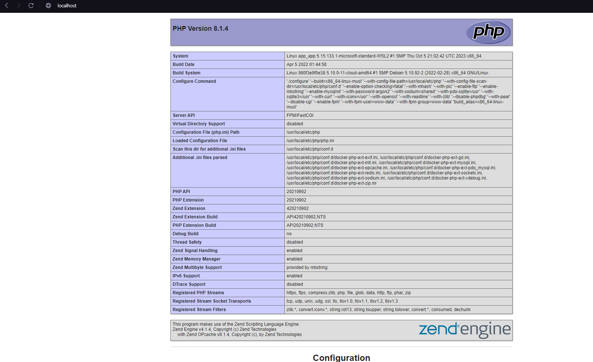
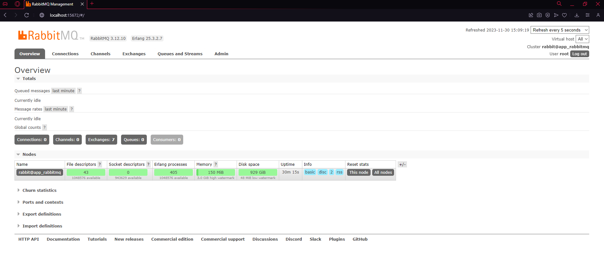
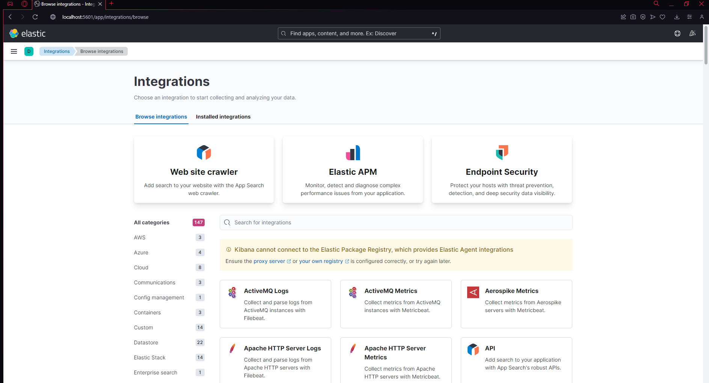
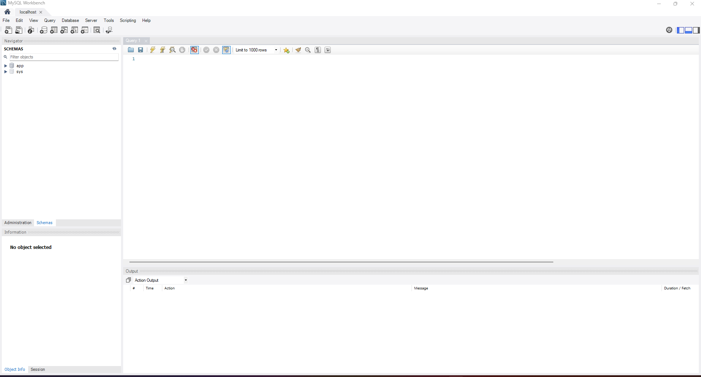
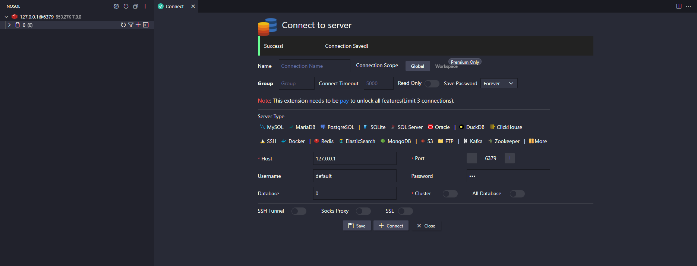

# setup_docker

## About the project
```
The objective of this project is to simplify the configuration of a Docker environment to run projects in PHP, although it can also be adapted to support other languages
```

## Technical Stack

```
PHP: 8.1
Nginx: 1.13
MySQL: 8.0
Elasticsearch: 8.2
Kibana: 8.2
RabbitMQ: 3
Redis: 3.15
```
## Getting Started
#### Prerequisites
Make sure you have Docker and Docker Compose installed on your machine.

[Docker Installation Guide](https://docs.docker.com/get-docker/)

[Docker Compose Installation Guide](https://docs.docker.com/compose/install/)

## Setting Up Docker

To start the Docker containers, run the following command:

```
docker-compose up -d --build
```

## [Localhost](http://localhost/)


## [RabbitMQ](http://localhost:15672/#/)


## [Kibana](http://localhost:5601/app/integrations/browse)


## [Mysql]()


## [Redis]()
